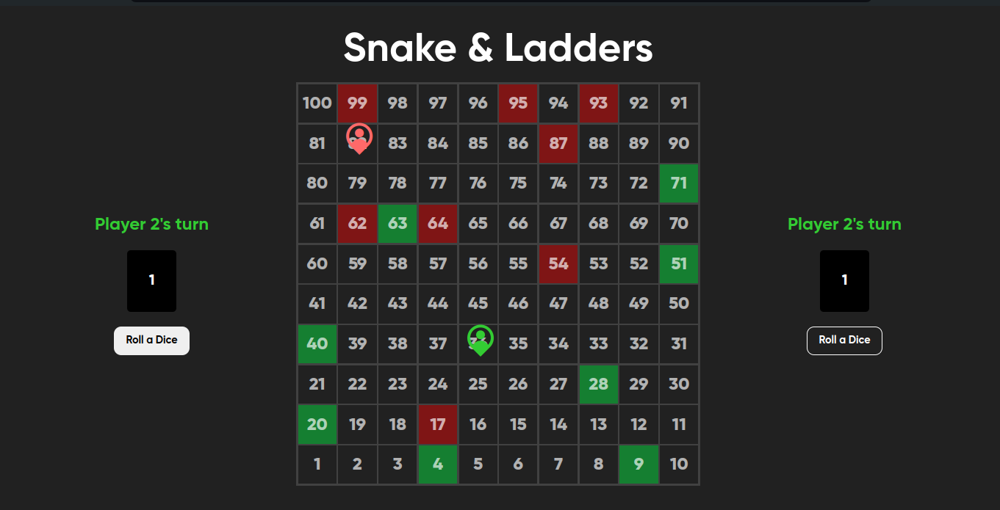

# Snake and Ladders Game

This is a classic Snake and Ladders game implemented using HTML, CSS, and JavaScript. The game allows two players to play on a virtual board.

## Table of Contents

- [Features](#features)
- [Installation](#installation)
- [Usage](#usage)
- [How to Play](#how-to-play)
- [Screenshots](#screenshots)
- [Contributing](#contributing)
- [License](#license)

## Features

- Two-player mode.
- Interactive game board with snakes and ladders.
- Dice roll display.
- Display of player positions and winner announcement.
- Responsive design for different screen sizes.

## Installation

1. Clone the repository:
    ```bash
    git clone https://github.com/YashS-2519/Snake-Ladders.git
    ```

2. Navigate to the project directory:
    ```bash
    cd Snake-Ladders
    ```

3. Open `index.html` in your browser to play the game.

## Usage

1. Open the `index.html` file in a web browser.
2. The game starts with Player 1. Click the "Roll Dice" button to roll the dice and move your piece.
3. The game alternates turns between Player 1 and Player 2 until one player reaches the last square.

## How to Play

1. Players take turns rolling a dice to move their piece forward on the board.
2. If a player lands at the bottom of a ladder( `show with green squares` ), they move up to the top of the ladder.
3. If a player lands on the head of a snake( `show with red squares` ), they slide down to the tail of the snake.
4. The first player to reach the last square on the board wins the game.
5. Click the "Restart" button to start a new game.

## Screenshots



## Contributing

Contributions are welcome! Please follow these steps:

1. Fork the repository.
2. Create a new branch (`git checkout -b feature-branch`).
3. Make your changes.
4. Commit your changes (`git commit -m 'Add some feature'`).
5. Push to the branch (`git push origin feature-branch`).
6. Open a pull request.

## License

This project is licensed under the MIT License - see the [LICENSE](LICENSE) file for details.
